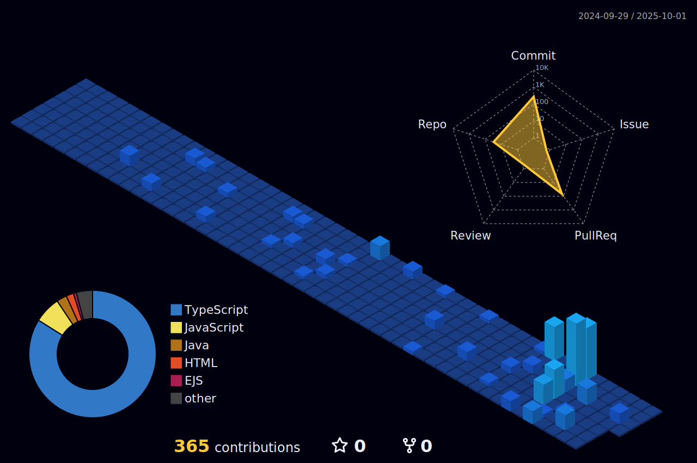

# README.md — Design **Futuriste & Ultra‑Attractif**

> Copie/colle **tout** ce contenu dans `README.md` du repo **AhmedAmineBejaoui**. Remplace les liens LinkedIn/Portfolio/Medium par les tiens.

---

<!-- ========= NEON / HOLOGRAPHIC HEADER ========= -->

<p align="center">
  
</p>

<!-- ========= TYPING BANNER ========= -->

<p align="center">
  <a href="https://github.com/AhmedAmineBejaoui">
    
  </a>
</p>

<!-- ========= SUBTITLE ========= -->

<p align="center">
  <b>Créateur d’expériences web léchées • Obsédé par l’UX, la perf et l’impact</b> ✨
</p>

<!-- ========= BADGES ========= -->

<p align="center">
  
  
  
</p>

---

## 🧠 À propos

* 👨‍💻 Je construis des apps utiles avec une vraie vision produit
* 🛠️ Core stack : **React, Next.js, Node.js, MongoDB, TailwindCSS**
* 🔐 Auth/Backend : **Express, Firebase, Supabase, FastAPI**
* 🌱 Focus 2025 : **AI appliquée au web** + **architectures serverless**
* 🤝 Ouvert aux collabs **AI • social • community tools**

---

## 🚀 Projets phares — cartes dynamiques

<p align="center">
  <a href="https://github.com/AhmedAmineBejaoui/elegance">
    
  </a>
  &nbsp;&nbsp;
  <a href="https://github.com/AhmedAmineBejaoui/neighborhood">
    
  </a>
</p>

---

## 🧰 Toolbox

<p align="center">
  
  
  
  
  
  
  
  
</p>

---

## 📊 Activité — néon & graphes

<p align="center">
  
  <br/>
  
  <br/>
  
  <br/>
  
  <br/>
  
</p>

---

## 🛰️ Add‑ons animés

* ✍️ **Typing banner** : déjà en haut.

* 🐍 **Snake contributions** (après génération du workflow) :

  ```md
  
  ```

* 🌌 **3D Contribution Graph** (optionnel) — rend un modèle 3D animé de tes commits (voir workflow ci‑dessous).

* 🧩 **Metrics (lowlighter)** (optionnel) — image composite ultra‑personnalisable (langages, PRs, issues, habits…).

---

## 🔗 Me retrouver

[](https://linkedin.com/in/tonprofil)
[](https://tonsite.com)
[](https://medium.com/@tonprofil)

---

<p align="center"><em>“Construire des outils simples pour résoudre des problèmes réels.”</em></p>

<p align="center">
  
</p>

---

# ⚙️ Workflows prêts à l’emploi (Ultra Futuriste)

> **Important** : Repo → **Settings → Actions → General → Workflow permissions** → sélectionner **Read and write permissions**.

## 1) Snake (branche `output` auto‑générée)

Crée `.github/workflows/snake.yml` :

```yaml
name: Generate Snake

on:
  schedule:
    - cron: "0 */12 * * *"   # 2x par jour
  workflow_dispatch:

jobs:
  build:
    runs-on: ubuntu-latest
    permissions:
      contents: write
    steps:
      - name: Checkout repo
        uses: actions/checkout@v3

      - name: Generate Snake
        uses: Platane/snk@v3
        with:
          github_user_name: AhmedAmineBejaoui
          outputs: |
            dist/github-contribution-grid-snake.svg

      - name: Push snake animation to output branch
        uses: crazy-max/ghaction-github-pages@v3
        with:
          target_branch: output
          build_dir: dist
        env:
          GITHUB_TOKEN: ${{ secrets.GITHUB_TOKEN }}
```

> Après le ✅, ajoute l’image dans le README (déjà fourni plus haut).

---

## 2) 3D Contribution Graph (optionnel)

Crée `.github/workflows/3d-contrib.yml` :

```yaml
name: 3D Contributions

on:
  schedule:
    - cron: "0 1 * * *"   # 1x par jour
  workflow_dispatch:

jobs:
  build:
    runs-on: ubuntu-latest
    permissions:
      contents: write
    steps:
      - uses: actions/checkout@v3
      - uses: yoshi389111/github-profile-3d-contrib@master
        with:
          OWNER: AhmedAmineBejaoui
      - name: Push
        run: |
          git config user.name github-actions
          git config user.email actions@github.com
          git add -A
          git commit -m "chore: update 3d contributions" || echo "no changes"
          git push
```

Ajoute ensuite dans le README où tu veux :

```md
<p align="center">
  
</p>
```

---

## 3) Metrics (optionnel, super modulable)

Crée `.github/workflows/metrics.yml` :

```yaml
name: Metrics

on:
  schedule:
    - cron: "0 */24 * * *"  # 1x par jour
  workflow_dispatch:

jobs:
  github-metrics:
    runs-on: ubuntu-latest
    permissions:
      contents: write
    steps:
      - uses: lowlighter/metrics@latest
        with:
          token: ${{ secrets.GITHUB_TOKEN }}
          user: AhmedAmineBejaoui
          template: classic
          base: header, activity, community, repositories, metadata
          config_timezone: Africa/Tunis
          plugin_isocalendar: yes
          plugin_languages: yes
          plugin_languages_ignored: html, css
          plugin_languages_limit: 8
          plugin_stars: yes
```

Affiche l’image générée :

```md
<p align="center">
  
</p>
```

---

## ✅ Conseils de finition

* **Pinned repos** : épingle 4–6 projets phares.
* Ajoute des **screenshots/GIF** courts dans chaque repo (UX > 1000 mots).
* Utilise des **titles & descriptions** concis.
* Des commits réguliers rendent les graphes plus vivants (Snake & Activity Graph).
